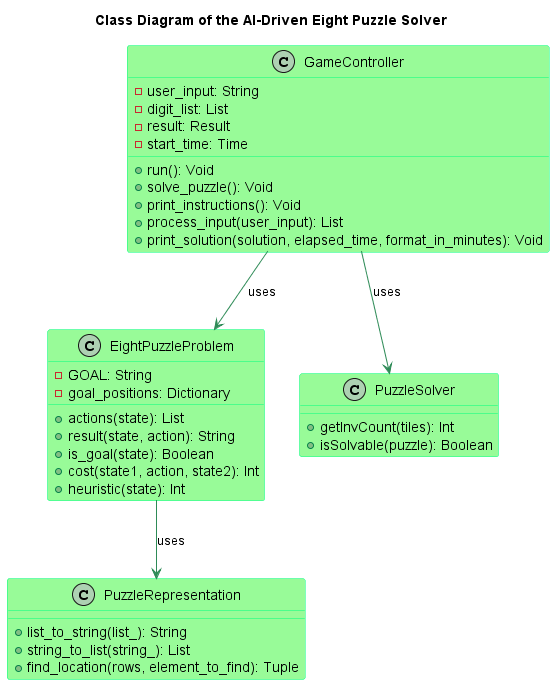
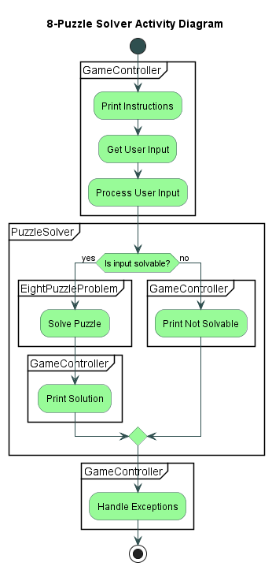
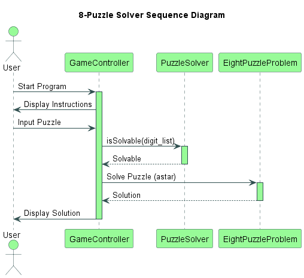
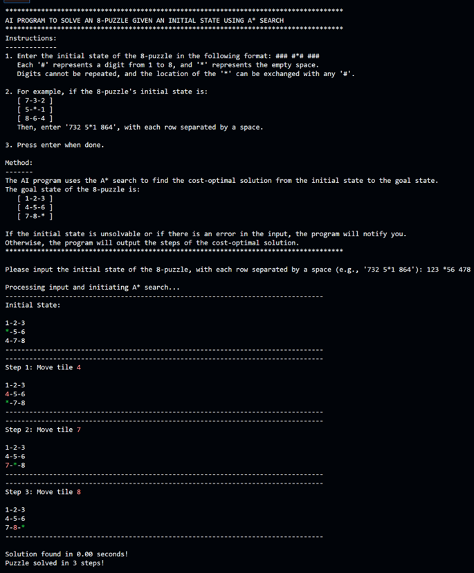
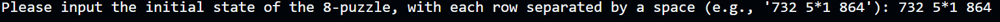
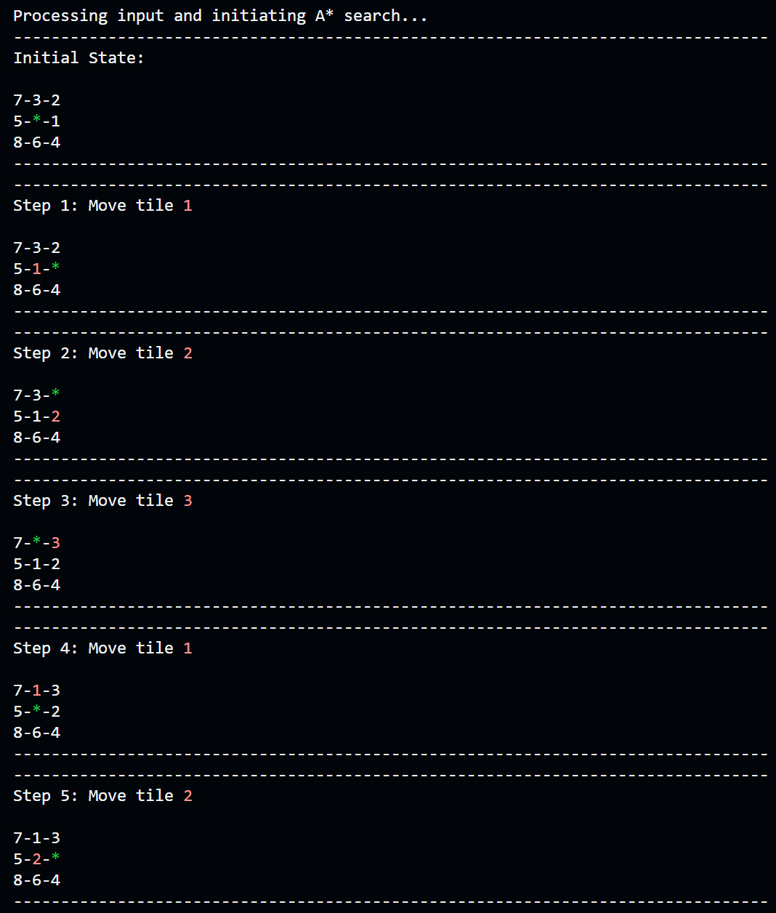
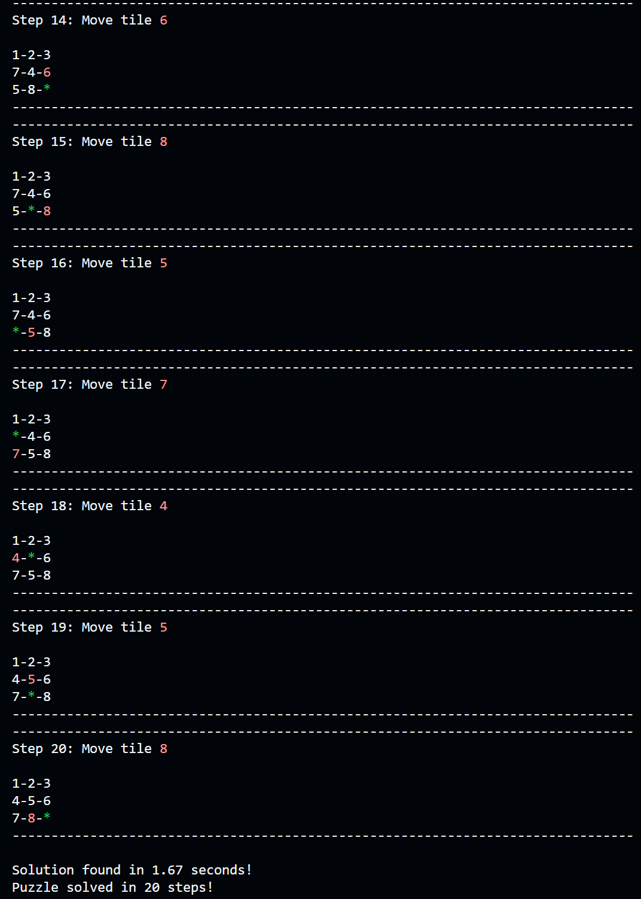

# 8-Puzzle Solver

## Overview
This project provides an artificial intelligence-based solution to solve the classic 8-puzzle game. It uses the A* search algorithm to find the optimal solution path from a given initial state to the goal state.

The 8-puzzle game is a sliding puzzle that consists of a frame of numbered square tiles in random order with one tile missing, on a 3x3 grid. The objective of the puzzle is to place the tiles in order by making sliding moves that use the empty space.

## Features
- Uses the A* search algorithm for optimal solution path.
- Checks the solvability of the given 8-puzzle.
- Computes the time taken to solve the puzzle.

## System Design

To get a better understanding of the structure and the flow of the program, refer to the class diagram, activity diagram, and sequence diagram provided below.

<h3 align="center">Class Diagram</h3>

  

<h3 align="center">Activity Diagram</h3>

  

<h3 align="center">Sequence Diagram</h3>

  

<h3 align="center">Application Screenshot</h3>

  

## Getting Started
These instructions will get you a copy of the project up and running on your local machine for development and testing purposes.

### Prerequisites
- Python 3.x
- simpleai library
- colorama library

### Installing
- Clone the repository: `git clone https://github.com/sminerport/eight-puzzle-solver.git`
- Install the requirements: `pip install -r requirements.txt`

## Usage
- Run `python main.py`
- Follow the instructions on the console to input the initial state of the puzzle.

Here's an example of how to enter the initial state of the puzzle:

  

And here's what the output might look like:

    

    

## Contributing

Pull requests are welcome. For major changes, please open an issue first to discuss what you would like to change. Please make sure to update tests as appropriate and adhere to the coding standards and practices defined in this project.

## License

This project is licensed under the MIT License - see the LICENSE.md file for details.

## Acknowledgments

- SimpleAI library
- OpenAI for the GPT-4 model that inspired this project

